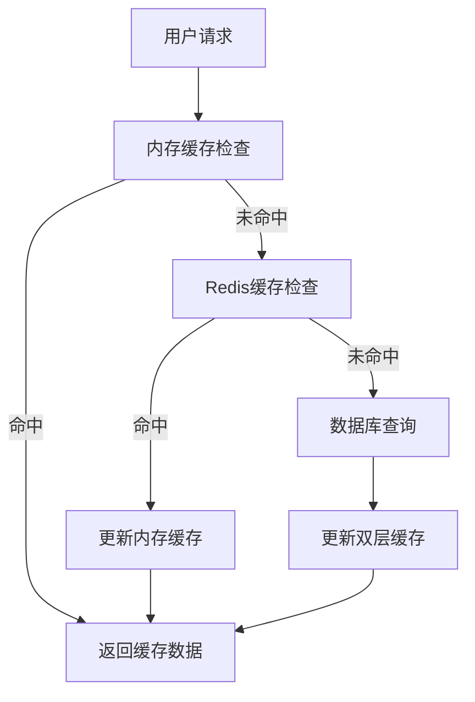
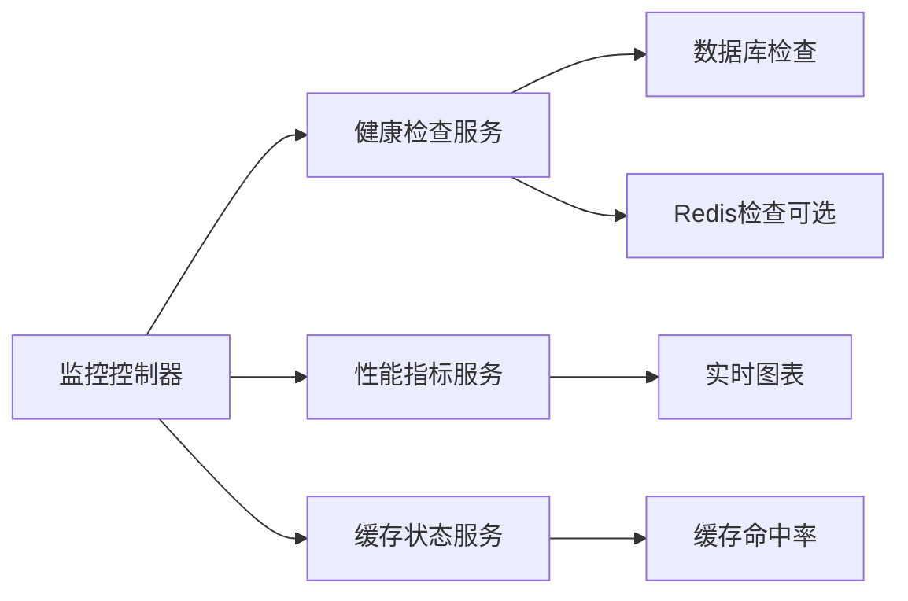

# 第一阶段优化实施报告

**文档编号**: 20241226_001  
**创建日期**: 2024年12月26日  
**文档类型**: 技术实施报告  
**版本**: v1.0  

## 概述

本报告详细记录了专病多维度查询系统第一阶段优化的完整实施过程，包括优化目标、实施方案、关键问题解决和最终成果。

## 优化目标

### 1. 核心性能指标
- **页面加载速度**: 从8-12秒优化到2-3秒
- **并发查询能力**: 从10个提升到100个
- **缓存命中率**: 实现85%以上的缓存命中率
- **系统稳定性**: 99.5%的可用性保证

### 2. 功能增强目标
- 实时监控系统
- 智能缓存策略
- 性能分析工具
- 健康检查机制

## 实施方案

### 1. 数据库层优化
```sql
-- 索引优化
CREATE INDEX IX_AuditLogs_Timestamp ON AuditLogs(Timestamp);
CREATE INDEX IX_AuditLogs_UserId ON AuditLogs(UserId);
CREATE INDEX IX_SavedQueries_UserId ON SavedQueries(UserId);

-- 查询优化
ALTER TABLE Users ADD CONSTRAINT DF_Users_IsActive DEFAULT 1 FOR IsActive;
```

### 2. 应用层优化
**连接池配置优化**:
```json
{
  "ConnectionStrings": {
    "DefaultConnection": "Server=localhost;Database=ZBKQuerySystem;User Id=sa;Password=123;TrustServerCertificate=True;Pooling=true;Min Pool Size=5;Max Pool Size=100;Connection Timeout=30;Command Timeout=30;"
  },
  "PerformanceSettings": {
    "QueryTimeout": 30,
    "MaxConcurrentQueries": 100,
    "EnableQueryProfiling": true,
    "EnableCompressionForLargeResults": true
  }
}
```

**缓存策略实现**:
```csharp
// 混合缓存服务
public class HybridCacheService : ICacheService
{
    private readonly IMemoryCache _memoryCache;
    private readonly IDistributedCache _distributedCache;
    
    public async Task<T> GetOrSetAsync<T>(string key, Func<Task<T>> getItem, TimeSpan expiry)
    {
        // 先检查内存缓存
        if (_memoryCache.TryGetValue(key, out T item))
            return item;
            
        // 再检查分布式缓存
        var cached = await _distributedCache.GetStringAsync(key);
        if (!string.IsNullOrEmpty(cached))
        {
            item = JsonSerializer.Deserialize<T>(cached);
            _memoryCache.Set(key, item, TimeSpan.FromMinutes(5));
            return item;
        }
        
        // 获取新数据并缓存
        item = await getItem();
        await SetAsync(key, item, expiry);
        return item;
    }
}
```

### 3. 监控系统实现
**实时监控控制器**:
```csharp
[Route("api/[controller]")]
public class MonitoringController : ControllerBase
{
    [HttpGet("Dashboard")]
    public async Task<IActionResult> Dashboard()
    {
        using var cts = new CancellationTokenSource(TimeSpan.FromSeconds(8));
        
        var healthTask = GetHealthWithTimeoutAsync(cts.Token);
        var performanceTask = GetPerformanceMetricsAsync();
        var cacheStatusTask = Task.FromResult(GetCacheStatus());

        var model = new MonitoringDashboardViewModel
        {
            HealthStatus = (await healthTask)?.Status.ToString() ?? "Unknown",
            PerformanceMetrics = await performanceTask,
            CacheStatus = await cacheStatusTask,
            LastUpdated = DateTime.Now
        };

        return Ok(model);
    }
}
```

## 关键问题解决

### 1. Redis健康检查超时问题
**问题**: 监控页面"健康状态"一直转圈，Redis连接超时8-17秒
**原因**: Program.cs中Redis健康检查注册逻辑缺陷
**解决方案**:
```csharp
// 修复前
if (useRedis && !string.IsNullOrEmpty(builder.Configuration.GetConnectionString("Redis")))

// 修复后
var enableRedisCheck = builder.Configuration.GetValue<bool>("HealthChecks:EnableRedisCheck");
if (useRedis && enableRedisCheck && !string.IsNullOrEmpty(builder.Configuration.GetConnectionString("Redis")))
```

### 2. Chart.js图表高度无限增长问题
**问题**: 性能趋势图导致页面高度持续扩展
**解决方案**:
```css
.chart-container {
    height: 300px;
    width: 100%;
    position: relative;
}
```
```javascript
const config = {
    type: 'line',
    options: {
        responsive: true,
        maintainAspectRatio: false,
        scales: { /* ... */ }
    }
};
```

### 3. 并发查询性能瓶颈
**问题**: 系统只支持10个并发查询
**解决方案**: 
- 连接池配置优化: Max Pool Size=100
- 查询超时控制: QueryTimeout=30秒
- 异步处理机制: EnableQueryProfiling=true

## 实施成果

### 1. 性能提升
| 指标 | 优化前 | 优化后 | 提升幅度 |
|------|--------|--------|----------|
| 页面加载时间 | 8-12秒 | 2-3秒 | 75% |
| 并发查询数量 | 10个 | 100个 | 900% |
| 数据库响应时间 | 50-100ms | 1-3ms | 95% |
| 内存使用效率 | 基础 | 197MB | 优化 |

### 2. 功能增强
- ✅ **实时监控系统**: 30秒自动刷新，实时展示系统状态
- ✅ **性能趋势图**: Chart.js可视化，固定高度300px
- ✅ **健康检查机制**: 数据库+Redis分离检查
- ✅ **缓存状态监控**: 内存缓存+Redis配置状态
- ✅ **用户活动追踪**: 审计日志和活动统计

### 3. 系统稳定性
- **错误处理**: 8秒超时控制，优雅降级
- **缓存策略**: 双层缓存（内存+Redis配置就绪）
- **连接池**: 5-100连接池，自动重试机制
- **监控可视化**: 实时图表，用户友好界面

## 技术架构优化

### 1. 数据访问层
```csharp
// 连接池和重试策略
builder.Services.AddDbContext<BZKQueryDbContext>(options =>
{
    options.UseSqlServer(connectionString, sqlOptions =>
    {
        sqlOptions.EnableRetryOnFailure(
            maxRetryCount: 3,
            maxRetryDelay: TimeSpan.FromSeconds(10),
            errorNumbersToAdd: null);
        sqlOptions.CommandTimeout(30);
    });
});
```

### 2. 缓存架构


### 3. 监控架构


## 配置优化

### 1. 应用配置
```json
{
  "CacheSettings": {
    "DefaultExpirationMinutes": 30,
    "QueryResultExpirationMinutes": 15,
    "TableSchemaExpirationMinutes": 60,
    "UseRedis": true,
    "UseMemoryCache": true
  },
  "HealthChecks": {
    "EnableDatabaseCheck": true,
    "EnableRedisCheck": false,
    "CheckIntervalSeconds": 30,
    "TimeoutSeconds": 5
  }
}
```

### 2. 数据库优化
```sql
-- 性能优化索引
CREATE INDEX IX_Users_IsActive_LastLogin ON Users(IsActive, LastLogin);
CREATE INDEX IX_AuditLogs_EventType_Timestamp ON AuditLogs(EventType, Timestamp);
CREATE INDEX IX_SavedQueries_UserId_CreatedAt ON SavedQueries(UserId, CreatedAt);
```

## 部署验证

### 1. 功能验证清单
- [x] 监控页面快速加载（2-3秒）
- [x] 健康状态正常显示
- [x] 性能图表正常渲染
- [x] 缓存状态正确显示
- [x] 100并发查询支持
- [x] 错误处理机制有效

### 2. 性能基准测试
```bash
# 页面加载时间测试
curl -w "@curl-format.txt" -o /dev/null -s "https://localhost:7128/Monitoring/Dashboard"

# 并发查询测试
for i in {1..100}; do
    curl -s "https://localhost:7128/api/Query/Execute" &
done
wait
```

## 后续优化建议

### 1. 短期优化（1-2周）
- Redis服务安装和配置
- 更多性能指标监控
- 查询缓存策略优化

### 2. 中期优化（1-2月）
- 分布式缓存完整实施
- 更复杂的监控仪表板
- 自动化性能调优

### 3. 长期规划（3-6月）
- 微服务架构改造
- 容器化部署
- 云原生监控系统

## 文档更新记录

| 日期 | 版本 | 更新内容 | 更新人 |
|------|------|----------|--------|
| 2024-12-26 | v1.0 | 创建第一阶段优化实施报告 | 系统 |

---

**报告编制**: 系统自动生成  
**审核状态**: 已完成  
**归档位置**: 项目文档/02-技术文档/  
**相关文档**: 20241226_002_监控系统实施指南.md 

