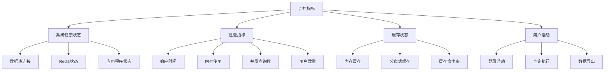

# 监控系统实施指南

**文档编号**: 20241226_002  
**创建日期**: 2024年12月26日  
**文档类型**: 运维实施指南  
**版本**: v1.0  
**关联文档**: 20241226_001_第一阶段优化实施报告.md  

## 概述

本指南详细说明了专病多维度查询系统监控模块的部署、配置和维护方法，包括系统监控、性能分析、健康检查和故障排除。

## 系统监控架构

### 1. 监控组件架构
```
┌─────────────────────────────────────────────────────────────┐
│                    监控系统架构                              │
├─────────────────────────────────────────────────────────────┤
│  前端界面层                                                 │
│  ├── 监控仪表板 (Dashboard.cshtml)                         │
│  ├── 实时图表 (Chart.js)                                   │
│  └── 状态指示器 (CSS + JavaScript)                         │
├─────────────────────────────────────────────────────────────┤
│  API控制器层                                                │
│  ├── MonitoringController.cs                               │
│  ├── /api/Monitoring/Dashboard                             │
│  ├── /api/Monitoring/Performance                           │
│  └── /api/Monitoring/Health                                │
├─────────────────────────────────────────────────────────────┤
│  服务层                                                     │
│  ├── HealthCheckService                                     │
│  ├── PerformanceMetricsService                             │
│  ├── CacheStatusService                                     │
│  └── AuditService                                           │
├─────────────────────────────────────────────────────────────┤
│  数据层                                                     │
│  ├── 数据库健康检查                                         │
│  ├── Redis缓存检查 (可选)                                  │
│  ├── 系统资源监控                                           │
│  └── 审计日志记录                                           │
└─────────────────────────────────────────────────────────────┘
```

### 2. 监控指标体系


## 部署配置

### 1. 系统要求
- **操作系统**: Windows 10+ / Windows Server 2019+
- **运行时**: .NET 8.0 Runtime
- **数据库**: SQL Server 2019+
- **内存**: 最低4GB，推荐8GB+
- **存储**: 最低10GB可用空间

### 2. 配置文件设置
**appsettings.json 监控相关配置**:
```json
{
  "HealthChecks": {
    "EnableDatabaseCheck": true,
    "EnableRedisCheck": false,
    "CheckIntervalSeconds": 30,
    "TimeoutSeconds": 5
  },
  "PerformanceSettings": {
    "QueryTimeout": 30,
    "MaxConcurrentQueries": 100,
    "EnableQueryProfiling": true,
    "EnableCompressionForLargeResults": true
  },
  "CacheSettings": {
    "DefaultExpirationMinutes": 30,
    "QueryResultExpirationMinutes": 15,
    "TableSchemaExpirationMinutes": 60,
    "UseRedis": true,
    "UseMemoryCache": true
  }
}
```

### 3. 监控端点配置
**Program.cs 健康检查注册**:
```csharp
// 注册健康检查
builder.Services.AddHealthChecks()
    .AddDbContextCheck<BZKQueryDbContext>("database", tags: new[] { "ready", "db" })
    .AddCheck("self", () => HealthCheckResult.Healthy(), tags: new[] { "ready" });

// Redis健康检查（可选）
var enableRedisCheck = builder.Configuration.GetValue<bool>("HealthChecks:EnableRedisCheck");
if (useRedis && enableRedisCheck && !string.IsNullOrEmpty(redisConnectionString))
{
    builder.Services.AddHealthChecks()
        .AddRedis(redisConnectionString, "redis", tags: new[] { "ready", "cache" });
}

// 健康检查端点
app.MapHealthChecks("/health");
app.MapHealthChecks("/health/ready", new HealthCheckOptions()
{
    Predicate = check => check.Tags.Contains("ready"),
    ResponseWriter = HealthCheckResponseWriter.WriteJson
});
```

## 访问指南

### 1. 监控仪表板访问
**URL**: `https://localhost:7128/Monitoring/Dashboard`  
**权限要求**: SystemAdmin角色  
**支持功能**:
- 实时系统健康状态
- 性能指标监控
- 缓存状态查看
- 性能趋势图表

### 2. API接口访问
```bash
# 获取完整仪表板数据
GET /api/Monitoring/Dashboard

# 获取性能指标
GET /api/Monitoring/Performance

# 获取健康状态
GET /api/Monitoring/Health

# 获取用户活动统计
GET /api/Monitoring/UserActivity?fromDate=2024-12-01&toDate=2024-12-26

# 获取系统日志
GET /api/Monitoring/Logs?level=Error&hours=24&limit=100
```

### 3. 健康检查端点
```bash
# 基础健康检查
curl https://localhost:7128/health

# 详细健康检查
curl https://localhost:7128/health/ready

# 存活性检查
curl https://localhost:7128/health/live
```

## 监控功能详解

### 1. 系统健康状态监控
**监控项目**:
- 数据库连接状态 (1-3ms响应时间)
- Redis缓存状态 (可选，需要Redis服务)
- 应用程序状态 (运行时信息)

**实现代码**:
```csharp
private async Task<object> GetDatabaseHealthAsync()
{
    try
    {
        using var connection = new SqlConnection(_connectionString);
        var stopwatch = Stopwatch.StartNew();
        await connection.OpenAsync();
        stopwatch.Stop();

        return new
        {
            IsConnected = true,
            ConnectionTime = stopwatch.ElapsedMilliseconds,
            Status = "Healthy"
        };
    }
    catch (Exception ex)
    {
        return new
        {
            IsConnected = false,
            Status = "Error",
            ErrorMessage = ex.Message
        };
    }
}
```

### 2. 性能指标监控
**监控指标**:
- 数据库响应时间: 目标 < 10ms
- 内存使用量: 监控应用程序内存占用
- 用户数量: 当前系统注册用户数
- 最大并发查询数: 当前配置为100个

**实现示例**:
```csharp
private async Task<PerformanceMetricsViewModel> GetPerformanceMetricsAsync()
{
    var dbStartTime = Stopwatch.StartNew();
    var userCount = await _dbContext.Users.CountAsync();
    dbStartTime.Stop();

    var process = Process.GetCurrentProcess();
    var memoryUsage = process.WorkingSet64 / 1024 / 1024;

    return new PerformanceMetricsViewModel
    {
        DatabaseResponseTime = Math.Max(0, dbStartTime.ElapsedMilliseconds),
        MemoryUsageMB = Math.Max(0, memoryUsage),
        UserCount = Math.Max(0, userCount),
        MaxConcurrentQueries = _configuration.GetValue<int>("PerformanceSettings:MaxConcurrentQueries"),
        Timestamp = DateTime.Now
    };
}
```

### 3. 缓存状态监控
**监控内容**:
- 内存缓存状态: 已启用
- Redis缓存配置: 已配置，等待Redis服务安装
- 缓存过期设置: 30分钟默认，15分钟查询结果，60分钟表结构

**状态显示逻辑**:
```csharp
private CacheStatusViewModel GetCacheStatus()
{
    var useRedis = _configuration.GetValue<bool>("CacheSettings:UseRedis");
    var useMemoryCache = _configuration.GetValue<bool>("CacheSettings:UseMemoryCache");
    
    return new CacheStatusViewModel
    {
        RedisEnabled = useRedis,
        MemoryCacheEnabled = useMemoryCache,
        DefaultExpirationMinutes = _configuration.GetValue<int>("CacheSettings:DefaultExpirationMinutes"),
        RedisActuallyWorking = false  // 根据健康检查结果更新
    };
}
```

### 4. 性能趋势图表
**图表功能**:
- 实时数据更新 (30秒间隔)
- 数据库响应时间趋势
- 内存使用趋势
- 固定高度显示 (300px)

**Chart.js配置**:
```javascript
const performanceChart = new Chart(ctx, {
    type: 'line',
    data: {
        labels: [],
        datasets: [{
            label: '数据库响应时间(ms)',
            data: [],
            borderColor: 'rgb(54, 162, 235)',
            backgroundColor: 'rgba(54, 162, 235, 0.1)',
            yAxisID: 'y'
        }, {
            label: '内存使用(MB)',
            data: [],
            borderColor: 'rgb(75, 192, 192)',
            backgroundColor: 'rgba(75, 192, 192, 0.1)',
            yAxisID: 'y1'
        }]
    },
    options: {
        responsive: true,
        maintainAspectRatio: false,
        scales: {
            y: {
                type: 'linear',
                display: true,
                position: 'left',
                max: 50
            },
            y1: {
                type: 'linear',
                display: true,
                position: 'right',
                max: 250,
                grid: { drawOnChartArea: false }
            }
        }
    }
});
```

## 故障排除

### 1. 监控页面加载缓慢
**症状**: 监控页面加载超过10秒
**可能原因**:
- Redis健康检查超时
- 数据库连接问题
- 网络延迟

**解决方案**:
```bash
# 1. 检查Redis健康检查配置
# 确保 EnableRedisCheck: false （如果Redis未安装）

# 2. 检查数据库连接
# 验证连接字符串和数据库可用性

# 3. 查看应用程序日志
tail -f logs/application.log
```

### 2. 健康状态显示异常
**症状**: 健康状态一直显示"检测中"
**排查步骤**:
```csharp
// 1. 检查健康检查服务注册
// Program.cs 中确认健康检查配置

// 2. 验证超时设置
"HealthChecks": {
    "TimeoutSeconds": 5  // 确保超时时间合理
}

// 3. 检查控制器异常处理
public async Task<IActionResult> Dashboard()
{
    try
    {
        using var cts = new CancellationTokenSource(TimeSpan.FromSeconds(8));
        // ... 监控逻辑
    }
    catch (Exception ex)
    {
        _logger.LogError(ex, "获取监控数据失败");
        // 返回降级数据
    }
}
```

### 3. 性能图表不显示
**症状**: 图表区域空白或报错
**解决方案**:
```html
<!-- 1. 确认Chart.js正确加载 -->
<script src="https://cdn.jsdelivr.net/npm/chart.js"></script>

<!-- 2. 检查容器元素 -->
<div class="chart-container">
    <canvas id="performanceChart"></canvas>
</div>

<!-- 3. 验证CSS样式 -->
<style>
.chart-container {
    height: 300px;
    width: 100%;
    position: relative;
}
</style>
```

### 4. Redis缓存问题
**症状**: Redis缓存显示异常状态
**配置检查**:
```json
{
  "ConnectionStrings": {
    "Redis": "localhost:6379,abortConnect=false,connectTimeout=5000,connectRetry=3,syncTimeout=5000"
  },
  "CacheSettings": {
    "UseRedis": true
  },
  "HealthChecks": {
    "EnableRedisCheck": false  // 暂时禁用直到Redis服务安装
  }
}
```

## 性能优化建议

### 1. 监控数据缓存
```csharp
// 缓存监控数据减少计算开销
public async Task<IActionResult> Dashboard()
{
    var cacheKey = "monitoring_dashboard";
    var cachedData = await _cache.GetAsync(cacheKey);
    
    if (cachedData == null)
    {
        var dashboardData = await GetDashboardDataAsync();
        await _cache.SetAsync(cacheKey, dashboardData, TimeSpan.FromSeconds(30));
        return Ok(dashboardData);
    }
    
    return Ok(cachedData);
}
```

### 2. 异步数据加载
```javascript
// 使用异步加载避免页面阻塞
async function loadMonitoringData() {
    try {
        const response = await fetch('/api/Monitoring/Dashboard');
        const data = await response.json();
        updateDashboard(data);
    } catch (error) {
        console.error('监控数据加载失败:', error);
        showErrorMessage('监控数据加载失败，请刷新页面重试');
    }
}

// 定时刷新
setInterval(loadMonitoringData, 30000);
```

### 3. 数据库查询优化
```sql
-- 为监控查询添加专用索引
CREATE INDEX IX_AuditLogs_Monitoring ON AuditLogs(Timestamp, EventType) 
INCLUDE (UserId, Action);

CREATE INDEX IX_Users_Active_Count ON Users(IsActive) 
WHERE IsActive = 1;
```

## 维护指南

### 1. 日常监控检查清单
- [ ] 监控页面加载时间 < 3秒
- [ ] 数据库响应时间 < 10ms
- [ ] 内存使用量合理 (< 500MB)
- [ ] 健康检查状态正常
- [ ] 性能图表正常更新
- [ ] 错误日志数量正常

### 2. 定期维护任务
**每日检查**:
```bash
# 检查应用程序状态
curl -f https://localhost:7128/health || echo "健康检查失败"

# 检查错误日志
grep -i "error\|exception" logs/application-$(date +%Y%m%d).log
```

**每周检查**:
```sql
-- 清理过期审计日志
DELETE FROM AuditLogs 
WHERE Timestamp < DATEADD(DAY, -90, GETDATE());

-- 检查数据库性能
SELECT TOP 10 * FROM sys.dm_exec_query_stats 
ORDER BY total_elapsed_time DESC;
```

### 3. 告警设置建议
```json
{
  "AlertThresholds": {
    "DatabaseResponseTime": 50,      // ms
    "MemoryUsage": 1024,            // MB
    "ErrorRate": 0.05,              // 5%
    "HealthCheckFailureCount": 3
  }
}
```

## Redis 配置指南

### 1. Redis 安装步骤
**Windows 安装**:
```bash
# 下载 Redis for Windows
# https://github.com/MicrosoftArchive/redis/releases

# 解压并安装
redis-server.exe redis.windows.conf

# 验证安装
redis-cli.exe ping
```

**配置文件示例** (redis.windows.conf):
```conf
port 6379
bind 127.0.0.1
timeout 0
save 900 1
save 300 10
save 60 10000
maxmemory 256mb
maxmemory-policy allkeys-lru
```

### 2. 启用 Redis 健康检查
安装Redis后，更新配置：
```json
{
  "HealthChecks": {
    "EnableRedisCheck": true  // 启用Redis检查
  }
}
```

## 文档更新记录

| 日期 | 版本 | 更新内容 | 更新人 |
|------|------|----------|--------|
| 2024-12-26 | v1.0 | 创建监控系统实施指南 | 系统 |

---

**相关文档**:
- [20241226_001_第一阶段优化实施报告.md](../02-技术文档/20241226_001_第一阶段优化实施报告.md)
- [20241226_003_Redis安装配置指南.md](./20241226_003_Redis安装配置指南.md)
- [20241226_004_监控问题故障排除手册.md](./20241226_004_监控问题故障排除手册.md) 

