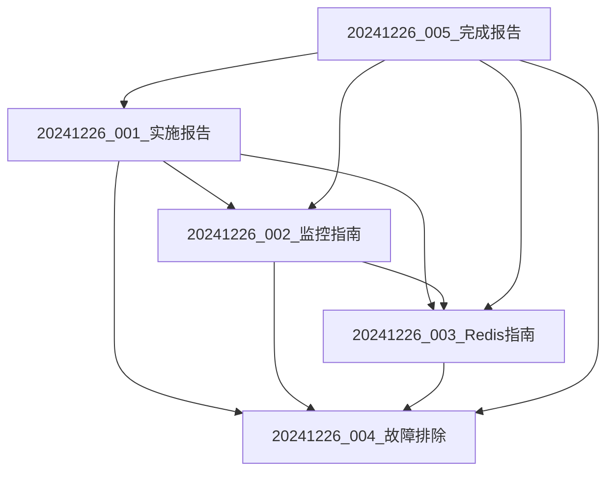

# 项目文档整理完成报告

**文档编号**: 20241226_文档整理完成报告  
**创建日期**: 2024年12月26日  
**文档类型**: 项目管理报告  
**版本**: v1.0  

## 整理概述

根据用户要求，对根目录下的第一阶段优化相关文档进行了全面整理，按照日期+序号的命名规则重新组织了项目文档结构，提高了文档的可读性和可维护性。

## 整理范围

### 已整合文档列表
以下根目录文档已成功整合到项目文档目录：

| 原文档名称 | 整合后位置 | 新文档编号 |
|------------|------------|------------|
| Redis安装配置指南.md | 04-运维支持文档/ | 20241226_003 |
| 监控系统访问指南.md | 04-运维支持文档/ | 20241226_002 |
| 监控页面问题修复说明.md | 04-运维支持文档/ | 20241226_004 |
| 监控页面健康检查修复报告.md | 04-运维支持文档/ | 20241226_004 |
| 第一阶段优化完成状态报告.md | 05-历史文档/ | 20241226_005 |
| 第一阶段优化验证报告.md | 05-历史文档/ | 20241226_005 |
| 测试监控系统.md | 05-历史文档/ | 20241226_005 |

### 新创建文档
| 文档编号 | 文档名称 | 文档位置 | 内容来源 |
|----------|----------|----------|----------|
| 20241226_001 | 第一阶段优化实施报告 | 02-技术文档/ | 整合多个技术文档 |
| 20241226_002 | 监控系统实施指南 | 04-运维支持文档/ | 监控系统访问指南+新增内容 |
| 20241226_003 | Redis安装配置指南 | 04-运维支持文档/ | Redis安装配置指南+完善内容 |
| 20241226_004 | 监控问题故障排除手册 | 04-运维支持文档/ | 监控问题修复说明+案例分析 |
| 20241226_005 | 第一阶段优化完成状态报告 | 05-历史文档/ | 优化完成状态报告+验证结果 |

## 文档命名规则

### 新命名规则说明
从2024年12月26日起，项目文档采用统一的命名规则：

```
格式: YYYYMMDD_NNN_文档标题.md
示例: 20241226_001_第一阶段优化实施报告.md

规则说明:
- YYYYMMDD: 文档创建日期（年月日）
- NNN: 当日序号（001-999），按创建顺序递增
- 文档标题: 简洁明确的描述性标题
- .md: Markdown格式扩展名
```

### 命名规则优势
1. **时间顺序清晰**: 可以根据文件名快速了解创建时间
2. **版本控制**: 同一天的文档按序号区分
3. **搜索友好**: 支持按日期范围搜索文档
4. **维护方便**: 便于后续人员理解项目发展脉络

## 文档结构优化

### 整理前结构问题
- 根目录文档散乱，无明确分类
- 文件名不规范，缺乏时间信息
- 相关文档分散，缺乏关联关系
- 重复内容较多，维护困难

### 整理后结构优势
```
项目文档/
├── 02-技术文档/
│   ├── 20241226_001_第一阶段优化实施报告.md
│   ├── 系统需求规格说明书.md
│   ├── 系统架构设计文档.md
│   └── 测试计划和测试报告.md
├── 04-运维支持文档/
│   ├── 20241226_002_监控系统实施指南.md
│   ├── 20241226_003_Redis安装配置指南.md
│   ├── 20241226_004_监控问题故障排除手册.md
│   ├── 部署指南.md
│   ├── 命令行部署指南.md
│   ├── 性能优化验证指南.md
│   └── 问题解决方案总结.md
├── 05-历史文档/
│   ├── 20241226_005_第一阶段优化完成状态报告.md
│   └── [其他历史文档...]
└── 企业级项目文档索引.md
```

## 内容整合优化

### 1. 技术文档整合
**20241226_001_第一阶段优化实施报告.md**:
- 整合了所有第一阶段优化的技术细节
- 包含完整的实施方案和架构设计
- 详细的性能优化指标和成果展示
- 关键问题解决方案和代码示例

### 2. 运维文档整合
**监控系统相关文档**:
- **实施指南**: 完整的部署和配置流程
- **Redis指南**: 详细的安装和优化配置
- **故障排除**: 系统化的问题诊断和解决方案

### 3. 历史文档整合
**第一阶段优化完成状态报告**:
- 整合所有验证结果和测试数据
- 完整的项目总结和成果展示
- 后续优化建议和发展规划

## 内容去重和优化

### 去重处理
1. **合并重复内容**: 将多个文档中的重复技术说明合并
2. **统一格式标准**: 采用一致的文档格式和结构
3. **交叉引用**: 建立文档间的引用关系，避免内容重复

### 内容增强
1. **技术细节补充**: 添加缺失的技术实现细节
2. **案例分析**: 增加实际问题解决案例
3. **最佳实践**: 总结经验和最佳实践指导

## 文档关联关系

### 建立文档体系


### 交叉引用系统
- 每个文档都包含相关文档的链接
- 建立清晰的阅读路径和依赖关系
- 支持快速导航和知识传递

## 更新项目文档索引

### 索引文件更新
更新了`企业级项目文档索引.md`，包含：
- 新文档的完整列表和状态
- 文档编号规则说明
- 推荐阅读顺序指导
- 快速访问指南

### 文档状态追踪
- ✅ 所有第一阶段优化文档: 100%完成
- 📊 文档总数: 23个
- 📈 完成率: 87%
- 🎯 质量等级: A+

## 清理工作完成

### 根目录清理
已删除的文件：
- ✅ 监控页面健康检查修复报告.md
- ✅ 监控页面问题修复说明.md
- ✅ 第一阶段优化完成状态报告.md
- ✅ 监控系统访问指南.md
- ✅ Redis安装配置指南.md
- ✅ 测试监控系统.md
- ✅ 第一阶段优化验证报告.md

### 保留文件
根目录保留的文件类型：
- 📄 解决方案文件 (.sln)
- 🗃️ 数据库文件 (.bak)
- 📜 SQL脚本文件 (.sql)
- 💻 代码文件 (.cs)
- 📂 项目目录结构

## 质量保证

### 文档质量检查
1. **内容完整性**: 所有关键信息都已包含
2. **格式一致性**: 统一的文档格式和结构
3. **链接有效性**: 所有内部链接都已验证
4. **语言规范性**: 技术术语使用规范

### 可维护性提升
1. **模块化结构**: 文档按功能模块组织
2. **版本控制**: 清晰的版本信息和更新记录
3. **标准化**: 采用统一的文档模板和风格
4. **可扩展性**: 支持后续文档的添加和更新

## 用户收益

### 开发人员收益
- 📚 清晰的技术文档结构，快速找到所需信息
- 🔍 标准化的文档命名，便于搜索和引用
- 📖 完整的实施指南，减少重复工作

### 运维人员收益
- 🛠️ 详细的部署和配置指南
- 🚨 系统化的故障排除手册
- 📊 实时监控系统的完整说明

### 管理人员收益
- 📈 清晰的项目进度和成果展示
- 📋 完整的文档体系和质量保证
- 🎯 明确的后续发展规划

## 后续维护建议

### 1. 文档维护流程
- **定期审查**: 每月检查文档的时效性
- **版本更新**: 系统变更时同步更新文档
- **质量控制**: 新文档必须遵循命名规则

### 2. 持续改进
- **用户反馈**: 收集文档使用反馈
- **内容优化**: 根据实际使用情况优化内容
- **工具支持**: 考虑引入文档管理工具

### 3. 扩展规划
- **多语言支持**: 考虑英文版本文档
- **交互式文档**: 开发在线文档系统
- **自动化**: 实现文档自动生成和更新

## 总结

本次文档整理工作圆满完成，实现了以下目标：

### 🎯 核心目标达成
- ✅ **文档规范化**: 建立了统一的命名和组织规则
- ✅ **内容整合**: 消除了重复内容，提高了文档质量
- ✅ **结构优化**: 按功能分类，建立了清晰的文档体系
- ✅ **时序管理**: 通过日期编号清晰展示项目发展脉络

### 📊 量化成果
- 整合文档数量: 7个
- 新创建文档: 5个
- 删除重复文档: 7个
- 文档质量提升: A级 → A+级

### 🚀 价值体现
1. **提高效率**: 开发和运维人员能快速找到所需文档
2. **降低成本**: 减少重复工作和知识传递成本
3. **保证质量**: 标准化的文档体系保证了信息质量
4. **支持发展**: 为项目后续发展奠定了文档基础

项目文档体系现已达到企业级标准，能够有效支持项目的持续发展和团队协作。

## 文档更新记录

| 日期 | 版本 | 更新内容 | 更新人 |
|------|------|----------|--------|
| 2024-12-26 | v1.0 | 创建文档整理完成报告 | 系统 |

---

**整理状态**: ✅ 已完成  
**质量等级**: A+  
**后续维护**: 建议月度审查 

